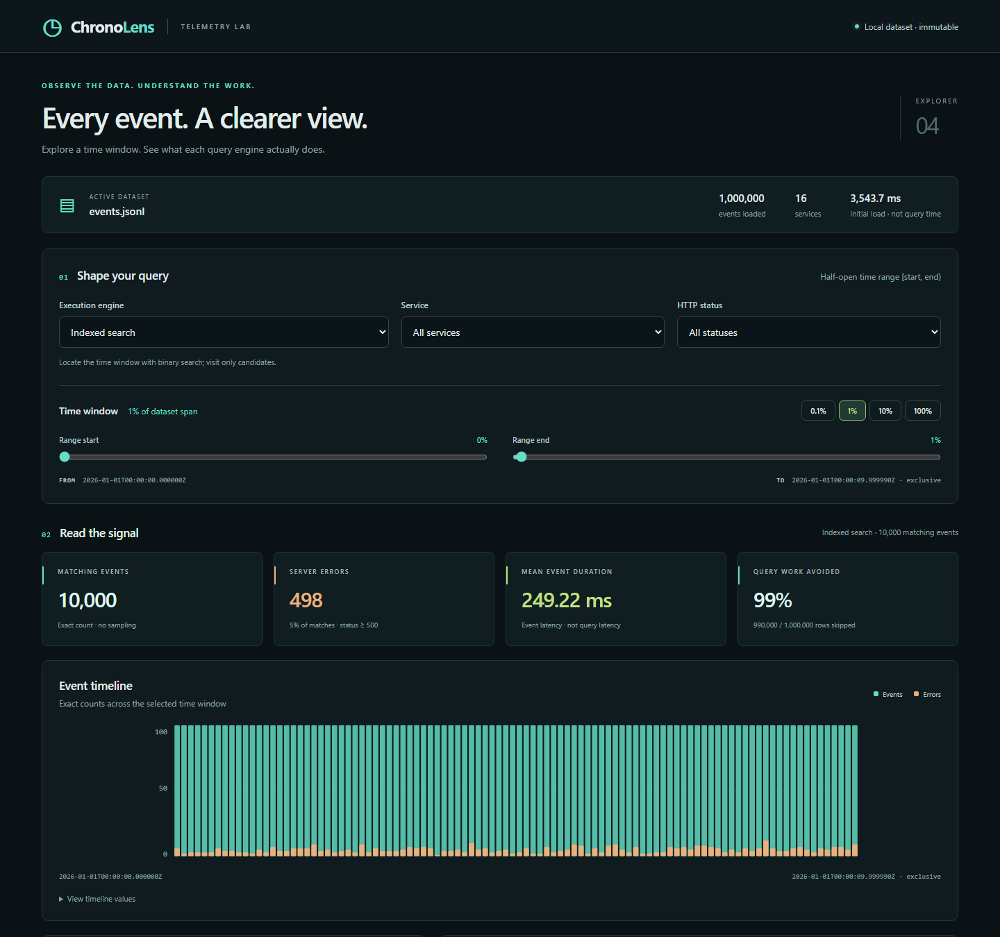
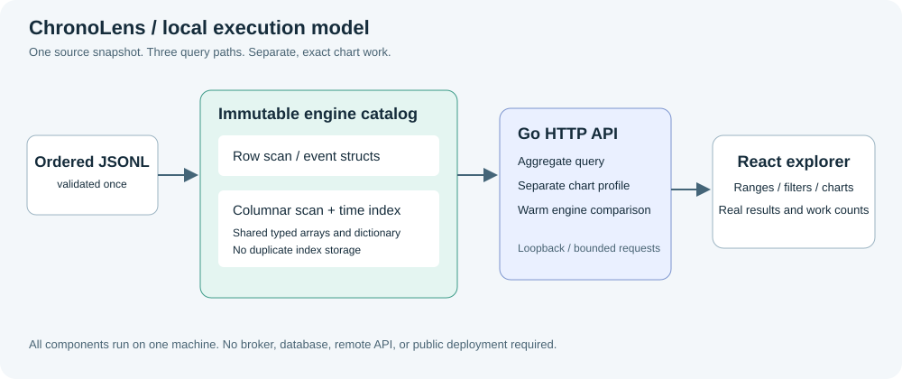

# ChronoLens

A local telemetry-analysis project exploring how storage layout and indexing
affect interactive queries over large event datasets.

**Current milestone: immutable snapshot codec and converter.** A deterministic generator,
validated JSONL reader, three query engines, diagnostic CLI, loopback-only Go API,
and React explorer are implemented. The opt-in incident profile creates correlated
traffic, service, failure, and latency spikes without changing the uniform baseline.
[A measured ten-million-event experiment](benchmarks/README.md) reports a
**0.0644 ms median warm batch mean** for a 0.1% time range, versus **42.60 ms**
for the row scan with identical results. Loading each layout took 42.5-46.7 seconds.
These are workload-specific query measurements, not browser latency or request p95.
The new [snapshot converter](docs/snapshots.md) adds a versioned, checksummed
binary export; query/explorer snapshot input follows in the next milestone.

## Why this exists

ChronoLens compares a straightforward event scan with column-oriented and indexed execution
over the **same data and query semantics**. Reproducible datasets, known-answer
tests, and explicit rows-examined statistics distinguish a real improvement
from a different answer or a misleading benchmark.

The explorer makes those differences visible: select a time window, filter by
service or status, inspect exact charts, then compare the three engines against
the same data. Candidate scans, index probes, and separate chart-construction
work are reported explicitly.

## Stack

Go implements ingestion, query execution, profiling, and HTTP serving with the
standard library. React, TypeScript, and Vite implement the browser interface;
Playwright exercises it against a real Go server. No broker, database, hosted
API, or container platform is required.

## Run locally

Install [Go 1.27 or later](https://go.dev/dl/), Node.js 22.17+ within the Node 22
release line, npm, and Git. No API keys or environment variables are required.
The Go CLI tools can be used without Node or a frontend build.

```sh
git clone https://github.com/PoojaAgarwal2003/ChronoLens.git
cd ChronoLens
go version
go run ./cmd/generator -events 100000 -seed 42 -output data/events.jsonl
cd web
npm ci
npm run build
cd ..
go run ./cmd/server -input data/events.jsonl -web web/dist -listen 127.0.0.1:8080
```

Open **http://127.0.0.1:8080**. Ctrl+C stops the server. It loads one source
snapshot at startup; row and columnar representations remain in memory and
indexed execution shares the columns.

These commands work in PowerShell and POSIX shells. The generator creates
parent directories and **refuses to overwrite an existing output file**.
Choose a new filename for each run, or deliberately remove an old dataset.
Generated files in `data/` are ignored by Git.

The server is **local-only, unauthenticated, and read-only**. Do not expose it
through a public proxy or tunnel. See the [developer and API guide](docs/local-explorer.md)
for endpoint examples, request limits, timing semantics, tests, and troubleshooting.



Shown: one million seeded events with a 1% time window, 10,000 matches, and
990,000 candidate rows skipped. [View the real comparison panel](docs/images/explorer-comparison.png).
Interactive timings in screenshots are observations, not portable performance guarantees.
The [ten-million-event demonstration](benchmarks/README.md#explorer-demonstration)
shows the larger dataset with exact charts and matching engine results.

For JSONL on standard output:

```sh
go run ./cmd/generator -events 3 -output -
```

Status messages go to standard error, never into the JSONL stream. Prefer
`-output` for files: older PowerShell redirection can change text encoding.

## Dataset contract

Each UTF-8 line contains one JSON event, with a trailing newline:

```json
{"timestamp_us":1767225600000000,"service":"service-001","duration_us":12000,"status":200}
```

This is a schema illustration, not a promised first record for seed 42.

| Field | Meaning |
|---|---|
| `timestamp_us` | Unix timestamp in microseconds; strictly increasing |
| `service` | Synthetic service name, such as `service-001` |
| `duration_us` | Uniform baseline: 100-500,000 microseconds; congested incident requests: 1,000,000-3,000,000 |
| `status` | 200 for success or 500 for a synthetic server error |

With the default `uniform` profile, services and durations are sampled uniformly. Error events are independent
Bernoulli samples: a 5% probability does not guarantee exactly 5% errors in a
finite dataset. This is a baseline workload, not a model of production traffic.

The `incident` profile compresses a middle event segment into a traffic burst
and routes most of those requests to `service-001` with higher durations and
failure probability. It is a deliberately constructed experiment, not a
simulation claiming to reproduce real production incidents.

The reader accepts a broader input contract: nonnegative signed 64-bit
timestamps, unsigned 32-bit durations (including zero), HTTP status codes
100-599, and nonempty service names up to 128 UTF-8 bytes. Input timestamps must
be nondecreasing; equal timestamps are allowed even though the generator emits
strictly increasing timestamps. See the [reader contract](docs/query-engine.md#input-contract).

## Generator options

```sh
go run ./cmd/generator -help
go run ./cmd/generator -events 1000000 -services 32 -seed 7 -interval 1ms -error-percent 10 -output data/million.jsonl
```

| Flag | Default | Constraint |
|---|---|---|
| `-events` | `100000` | Positive integer; resulting timestamps must fit signed 64-bit microseconds |
| `-services` | `16` | 1 through 1,024 |
| `-seed` | `42` | Signed 64-bit integer |
| `-profile` | `uniform` | `uniform` or `incident`; incident requires at least 5 events and an interval divisible by 4 microseconds |
| `-start` | `2026-01-01T00:00:00Z` | RFC3339 time, at or after the Unix epoch, through year 9999; no sub-microsecond precision |
| `-interval` | `1ms` | Positive whole microseconds, expressed as a Go duration |
| `-error-percent` | `5` | Baseline probability, 0-100; congested incident requests use `max(80, value)` |
| `-output` | `data/events.jsonl` | New file path, or `-` for standard output |

The same configuration and generator version produce byte-identical output.
The generator does not read the wall clock or buffer the whole dataset.
Additional working memory is proportional to the configured service count,
plus a fixed output buffer.

For a visible, reproducible incident:

```sh
go run ./cmd/generator -events 100000 -profile incident -seed 42 -output data/incident.jsonl
go run ./cmd/server -input data/incident.jsonl -web web/dist -listen 127.0.0.1:8080
```

Start with the full timeline, locate the burst near the middle, and filter
`service-001` and status `500`. See [workload definitions and expected results](docs/workloads.md).
Existing uniform data is byte-compatible with earlier milestones.

Invalid arguments fail before creating a dataset. Handled write failures and
Ctrl+C cancellation remove an incomplete file created by that invocation.
Force-killing the process, power loss, or cleanup permission errors can leave
a partial file; outputs are not atomically published or guaranteed crash-durable.
Standard-output consumers must discard partial output if the command fails.

The built executable uses exit code 0 for success/help, 2 for argument errors,
and 1 for generation or I/O errors. `go run` may translate a child failure to
its own exit code.

## Query a dataset

```sh
go run ./cmd/query -input data/events.jsonl -engine row
go run ./cmd/query -input data/events.jsonl -engine columnar
go run ./cmd/query -input data/events.jsonl -engine indexed -from-us 1767225620000000 -to-us 1767225630000000 -service service-001 -status 500
go run ./cmd/query -help
```

Queries return JSON containing count, server-error count, duration sum, mean,
minimum, maximum, and scan statistics. The time range is **inclusive at
`-from-us`, exclusive at `-to-us`**; an omitted upper bound is unbounded.
Service and status filters are exact matches. An unknown service returns zero
matches, not an input error.

Each invocation loads **only the selected layout** into memory, then executes
one query. Row and columnar scans visit every row. The indexed engine binary-searches
the sorted timestamps and visits only the selected interval, then applies the
same remaining predicates. Statistics distinguish candidate rows examined,
rows skipped, and index comparisons. `load_ms` includes
file reading, validation, and layout construction; `query_ms` measures only
in-memory execution. Neither number is a repeated-run latency percentile.
If the clock does not advance during an operation, its timing is `null` with
an explanatory note, not a claim of zero-millisecond execution.

The default `-max-events 1000000` prevents accidentally loading more than one
million events; exceeding the limit is an error, never silent truncation.
Raise this explicitly for larger inputs if sufficient memory is available.
It is a row-count guard, not an exact memory limit.

Malformed input is reported with a line number and no success-shaped partial
result. Missing, duplicate, unknown, null, and incorrectly typed fields are
rejected. Empty files produce a zero-count result with null mean/min/max.

Read the [query design and benchmark methodology](docs/query-engine.md) and
[indexed query design](docs/indexed-queries.md) for
the complete CLI contract, architecture, measured results, and limitations.

## Architecture and structure



The CLI loads one selected layout. The server loads a shared comparison catalog
and serves the static frontend from `web/dist`. Chart profiles are a separate,
bounded indexed pass; they are not hidden in aggregate-only timings.
The benchmark runner loads one layout at a time, verifies source hashes and
full aggregate equivalence, and reports raw warm batches separately from loading.

```text
cmd/generator/          CLI, output handling, and CLI tests
cmd/pack/               Validated JSONL-to-snapshot conversion and safe publication
cmd/query/              Query CLI and JSON reporting
cmd/bench/              Bounded benchmark CLI and report output
cmd/server/             Local server lifecycle and startup validation
internal/generator/    Deterministic generation and validation tests
internal/telemetry/    Shared schema, strict JSONL reader, and fuzz tests
internal/snapshot/     Bounded block-columnar codec, integrity checks, corruption tests
internal/query/        Layouts, time index, shared catalog, exact chart profiles
internal/api/          Local HTTP routes, limits, origin guards, comparison batches
internal/measure/      Explicit handling of unresolved clock timings
internal/benchmark/    Single-layout experiments, provenance, batch timing, heap snapshots
benchmarks/            Raw results, independent oracle, chart renderer, reproduction guide
web/                   React UI, build configuration, real-server browser tests
docs/                  Architecture, API/setup guides, measurements, original images
.github/workflows/     Go checks on Windows and Linux
go.mod                 Module and minimum Go version
```

## Development

```sh
go test -count=1 ./...
go test -cover ./...
go test ./internal/query -run '^$' -bench '^BenchmarkQuery$' -benchmem -count=3
go test ./internal/query -run '^$' -bench '^BenchmarkSelectivity$' -benchmem -benchtime=200ms -count=3
go vet ./...
go build ./...
gofmt -w cmd internal
```

To build standalone CLIs, first create a `bin` directory, then run:

```sh
go build -o bin/chronolens-generator ./cmd/generator
go build -o bin/chronolens-pack ./cmd/pack
go build -o bin/chronolens-query ./cmd/query
go build -o bin/chronolens-bench ./cmd/bench
go build -o bin/chronolens-server ./cmd/server
```

On Windows, add `.exe` to each output filename.
The server also needs the built `web/dist` directory; it is not embedded.

Tests cover reproducibility, timestamp order, schema bounds, invalid arguments,
overflow, writer failures, cancellation, and preservation of existing files.
Query tests additionally cover known aggregates, engine equivalence, half-open
time ranges, dictionary limits, concurrent reads, and malformed input. The CI
workflow runs tests, vet, build, and formatting checks on Windows and Linux,
plus query/API/server race detection on Linux. A separate CI job builds the
frontend and runs Chromium browser tests against a real generated dataset.
The benchmark runner is also exercised under the race detector. Its tests cover
source mutation, complete aggregate agreement, overflow-safe range construction,
deadline handling, and unresolved clocks. The existing Playwright suite also
checks the independent oracle and reproducibility of the published benchmark chart.

```sh
cd web
npm ci
npm run build
npm run test:e2e
```

If Chromium is missing, run `npx playwright install chromium`. See the
[developer guide](docs/local-explorer.md#development-and-tests) for Linux browser
dependencies and local frontend iteration.

### Troubleshooting

- **`go` is not recognized:** install Go, reopen your terminal, and run `go version`.
- **Output already exists:** choose a new `-output` path; overwrites are intentionally forbidden.
- **Permission denied or disk full:** choose a writable directory with sufficient free space.
- **Unexpected sub-microsecond precision error:** use a start time and interval aligned to microseconds.
- **Dataset exceeds max-events:** explicitly increase the query limit or choose a smaller dataset.
- **Reader error on line N:** check the exact field names, types, and timestamp order; the reader does not repair or silently skip records.

## Next milestones

The [scoped remaining-work roadmap](docs/roadmap.md) separates the current
storage/startup work from the intentionally deferred half: concurrent-load
experiments, release packaging, and licensing/deployment decisions.

Ten-million-event warm selective queries are now measured, with
[raw samples and reproduction commands](benchmarks/README.md). Cold-start,
concurrent-load, and end-to-end UI latency targets remain separate, unverified goals.

## Contributing and licensing

Keep changes focused, include tests for behavior changes, and run the development
checks above. Never commit generated datasets, credentials, or benchmark claims
without the corresponding workload and measurement method.

A license has not been selected yet. Public source availability alone does not
grant an open-source license.
