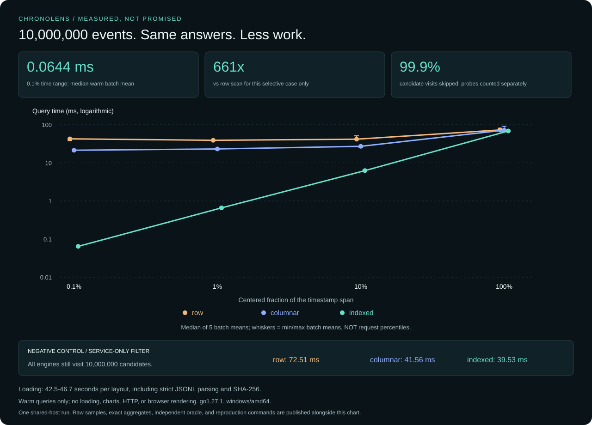
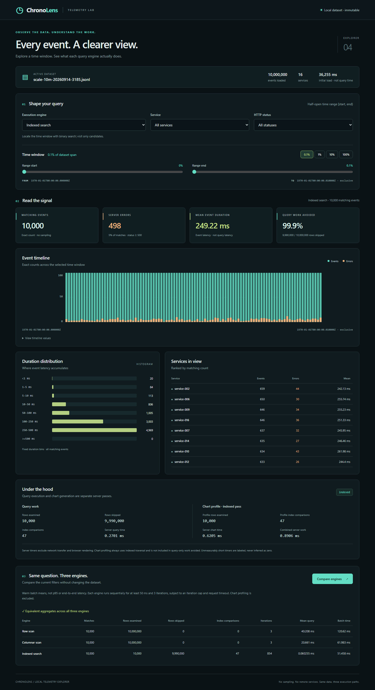

# Ten million events: measurements and reproduction

ChronoLens processed **10,000,000 generated events** in a measured experiment on
2026-09-14. A centered 0.1% time-range query examined 10,000 candidate rows and
reported a **0.0644 ms median warm batch mean**, compared with **42.60 ms** for
the row scan on the same input and predicates.

That is about **661x less query time in this selective case**, not a universal
speedup. Loading and validating each layout took **42.5-46.7 seconds**. These are
not browser latencies, request percentiles, cold-cache results, or throughput
under concurrent load.



## Published evidence

- [Native benchmark report: all 75 raw batches, aggregates, work counts, heap snapshots](results/windows-10m-20260914.json)
- [Independent JavaScript aggregate oracle](results/windows-10m-20260914.oracle.json)
- [Host, command arguments, environment, and source-file hashes](results/windows-10m-20260914.environment.json)

The benchmark executable was built from the milestone's uncommitted source
based on `52fb888`. Its Go build metadata correctly says `vcs.modified=true`.
The environment manifest records the relevant source-file SHA-256 values with
LF-normalized line endings matching Git blobs. The original CRLF `go.mod`
working-tree hash is preserved separately.
The implementation and evidence are published together, without retroactively
changing build metadata or inventing an earlier clean commit.

## Exact workload and environment

| Setting | Value |
|---|---|
| Events | 10,000,000 |
| Generator | Uniform profile; seed 42; 16 services; 5% error probability |
| Timestamps | Epoch start; one-microsecond spacing; integers 0 through 9,999,999 |
| JSONL bytes | 826,673,337 (826.7 MB decimal; approximately 788.4 MiB) |
| Input SHA-256 | `afce58436b7e769ddce7daef80c4a827d4b3f2f73bbeaf456cd203e24d290498` |
| Host | Shared Windows 11 Enterprise development environment, not a personal laptop |
| CPU | Intel Xeon Platinum 8370C at 2.80 GHz; 8 reported cores, 16 logical processors |
| Runtime | Go 1.27.1, windows/amd64, CGO disabled |
| Process settings | `GOMAXPROCS=16`, `GOGC=100`, `GOMEMLIMIT=1GiB` |
| Available RAM at start | Approximately 18.29 GiB of 63.95 GiB |
| Measurement | Five batches per engine/case; each at least 200 ms and three queries |

All three loads consumed the same bytes and SHA-256. All 15 engine/case
aggregates matched the independent Node.js implementation, including counts,
errors, duration sums, means, minima, and maxima. All 75 batches met the
configured timing window; none was reported as zero or unresolved.

## Query results

Each cell is the **median of five batch means**, in milliseconds.

| Predicate | Row scan | Columnar scan | Indexed | Indexed candidates |
|---|---:|---:|---:|---:|
| Centered 0.1% time range | 42.6003 | 21.4161 | 0.0644 | 10,000 |
| Centered 1% time range | 39.0509 | 23.1463 | 0.6589 | 100,000 |
| Centered 10% time range | 41.7636 | 27.1565 | 6.2556 | 1,000,000 |
| Full time range | 72.8891 | 72.1092 | 68.5973 | 10,000,000 |
| Service-only `service-001` | 72.5135 | 41.5575 | 39.5286 | 10,000,000 |

Both scan engines visit all ten million candidates in every case. The narrowest
indexed query skips **9,990,000 candidate visits**, performs **45 timestamp
comparisons**, and returns exactly **10,000 events**, **485 errors**, and
**2,498,817,565 total duration microseconds**.

The mechanism is lower-bound searches over sorted timestamps followed by
O(K) aggregation. It is not a cached aggregate. The narrow working set also
fits caches better, so do not attribute the measured ratio solely to the
arithmetic ratio of candidate counts.

The full-range and service-only controls matter: the time index cannot skip
candidates in either case. Small differences between columnar and indexed
full scans are not evidence that binary search accelerates an unselective query.

The 0.1% indexed batch means ranged from **0.0625 to 0.0660 ms**; row batch
means ranged from **38.48 to 43.17 ms**. The full columnar range was more variable,
**66.86 to 91.09 ms**. These ranges summarize batch means, not individual query
latencies or confidence intervals. This is one report from a shared host, not a
multi-host performance guarantee.

## Loading and retained heap

| Layout | Load + validation + hashing (seconds) | Retained Go heap delta after GC (MiB) |
|---|---:|---:|
| Row | 46.693 | 308.53 |
| Columnar | 44.386 | 174.88 |
| Indexed | 42.483 | 174.87 |

Only one layout is retained at a time. Before loading the next layout, a forced
GC can release the previous one. The two heap snapshots use process-wide
`runtime.MemStats.HeapAlloc`, before loading and after loading/GC with the
dataset explicitly kept alive.

The signed difference includes runtime noise and small retained report values.
It is **not peak memory, total allocations, OS working set, or RSS**. The Go
memory limit is soft, not a hard process cap. The server's simultaneous
row/columnar catalog has a different memory footprint.

Each load includes file open/stat/read/close, strict JSONL validation, SHA-256,
and layout construction. Explicit GC and metadata collection are excluded.
The fixed order is row, columnar, indexed; filesystem caches are not flushed.
Do not use these numbers as an isolated comparison of disk or parser throughput.

## Reproduce

Start with a smaller dataset on a resource-constrained machine. Go alone is
sufficient for the benchmark runner; Node is optional for the oracle and SVG.
No API, paid service, broker, or database is required.

```sh
go run ./cmd/generator -events 10000000 -services 16 -seed 42 -start 1970-01-01T00:00:00Z -interval 1us -error-percent 5 -profile uniform -output data/scale-10m-20260914-3185.jsonl
go build -o bin/chronolens-bench ./cmd/bench
```

Create `bin` first if needed. On Windows, add `.exe` to the build output.
The generator refuses to replace an existing file. Keep the input unchanged
until all three engine loads finish.

POSIX shell, using a new report filename:

```sh
GOMEMLIMIT=1GiB GOGC=100 GOMAXPROCS=16 ./bin/chronolens-bench -input data/scale-10m-20260914-3185.jsonl -max-events 10000000 -samples 5 -window 200ms -max-iterations 1000000 -timeout 10m > data/my-report.json
```

PowerShell 7, using a new report filename:

```powershell
$env:GOMEMLIMIT = '1GiB'
$env:GOGC = '100'
$env:GOMAXPROCS = '16'
.\bin\chronolens-bench.exe -input data/scale-10m-20260914-3185.jsonl -max-events 10000000 -samples 5 -window 200ms -max-iterations 1000000 -timeout 10m |
    Set-Content -Encoding utf8 data/my-report.json
if ($LASTEXITCODE -ne 0) { throw 'Benchmark failed; discard the report.' }
```

These environment settings affect child processes launched from that shell.
Use a separate shell or restore your previous values afterward. No global
machine settings are required. The CLI writes a report to stdout only after a
successful run; shell redirection can still leave an empty or partial file on
failure and can overwrite an existing destination.

Optional independent arithmetic and chart generation:

```sh
node benchmarks/uniform-oracle.mjs data/scale-10m-20260914-3185.jsonl 10000000
node benchmarks/render-chart.mjs data/my-report.json data/my-chart.svg
```

The oracle streams the file and independently computes aggregates with BigInt
duration sums. It checks the documented epoch-start, one-microsecond, uniform
fixture contract; it is not a general JSONL validator or a performance test.
The chart reads measured report summaries, requires stable positive timings,
uses a logarithmic axis, and refuses to overwrite an existing SVG.

## CLI and report contract

| Flag | Default | Bounds |
|---|---|---|
| `-input` | `data/events.jsonl` | Regular ordered JSONL file; empty datasets rejected |
| `-max-events` | `1000000` | 1-100,000,000; a row guard, not a memory cap |
| `-samples` | `5` | 1-100 batches per engine/case |
| `-window` | `100ms` | Greater than zero, at most one minute |
| `-max-iterations` | `1000000` | 3-100,000,000 queries per batch |
| `-timeout` | `10m` | Greater than zero, at most 24 hours |

The time domain is `[min_timestamp, max_timestamp+1)`. For each divisor
1000/100/10/1, width is `ceil(span/divisor)` and the start is
`min+floor((span-width)/2)`. Integer arithmetic handles rounding, timestamp ties,
and the conceptual endpoint MaxInt64+1 without overflowing. That endpoint is
represented by an unbounded `to_us`. Event selectivity need not equal the
selected fraction of time; every report includes actual endpoints and counts.
The service-only control chooses the first lexicographically sorted service.

`source` records input provenance. `cases` records predicates and actual time
matches. `engines[].cases[].samples` contains iterations, elapsed time, batch
mean, and stability; `batch_mean_ms` summarizes those means with min/median/max.
`engines[].heap` records explicit before/after snapshots and a signed delta.

Each case has an untimed warmup. Timed batches include query calls, loop/clock/
context overhead, error handling, and full aggregate stability checks. They
exclude loading, explicit GC, metadata, warmup, profiles, HTTP, rendering, and
report construction. Normal runtime GC is not disabled.

If the iteration cap is reached before the window, or the clock never advances,
the batch mean is null and `stable_window=false`. Any unstable batch makes that
case's summary null. A timeout, load/hash mismatch, invalid input, or changed
aggregate fails the run rather than returning partial success.

Cancellation is cooperative around regular-file reads, explicit GC, and query
loops; a blocked OS call or GC can delay it. JSON uses numeric CLI integer fields,
unlike the API's string-encoded timestamps: use an integer-preserving parser for
arbitrary int64 timestamps or uint64 sums beyond JavaScript's safe integer range.
The published fixture's values are within that range.

## Explorer demonstration

The same ten-million-event file also loads in the existing explorer. After
building the frontend using the [local setup guide](../README.md#run-locally):

```sh
go run ./cmd/server -input data/scale-10m-20260914-3185.jsonl -max-events 10000000 -web web/dist -listen 127.0.0.1:8080
```



The full dataset, a narrow filter, exact chart counts, and all three engine
comparisons were exercised against the real server. This screenshot uses the
**first** 0.1% window, `[0,10000)`, whereas the benchmark report uses the
**centered** window, `[4995000,5005000)`. Counts, errors, probes, and interactive
timings therefore need not equal the benchmark table. Responses are not mocked.

The API comparison uses its existing shorter batching protocol and a shared
catalog; it is not the CLI experiment. The server does not hash input during
loading and retains both row and columnar layouts. Neither the screenshot nor
this functional smoke test establishes an end-to-end UI latency percentile.

Tests for the independent oracle and chart generator run through the existing
Playwright suite with `npm run test:e2e` in `web`. They check hand-calculated
aggregates, ceiling boundaries, invalid counts, chart reproducibility,
non-overwriting output, unstable timings, and explicit null loading times.

## What this establishes, and what it does not

This experiment demonstrates exact warm aggregate queries over ten million
loaded events, including a selective result well below the original 100 ms
target. It does not establish a UI p95 SLO, cold-start responsiveness, concurrent
load capacity, persistent storage performance, or production deployment safety.

The next storage experiment should attack the visible bottleneck: startup still
spends tens of seconds parsing JSONL. A versioned binary layout could reduce
that cost, but no such format or result is claimed here.
