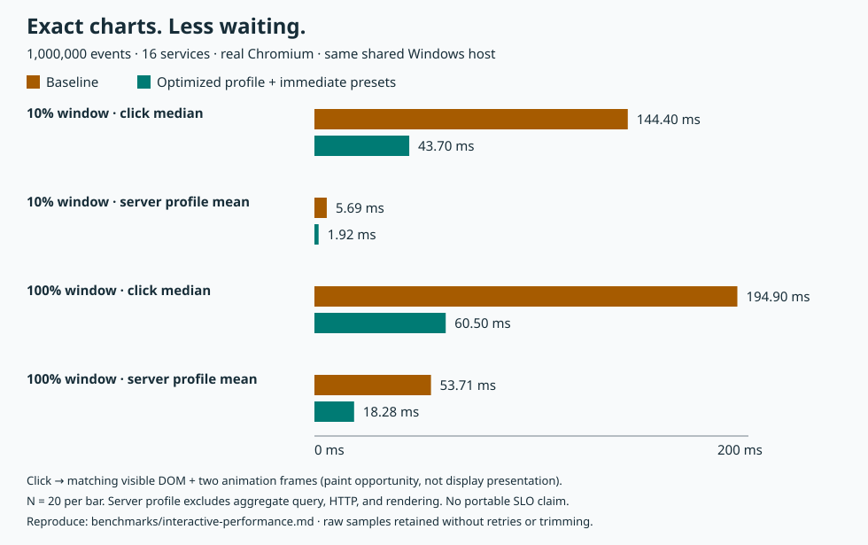

# Interactive profile and preset performance — milestone 13

Measured on 2026-09-16, on the same shared Windows amd64 host. This milestone
optimizes the **exact chart pass**, not aggregate query semantics, and removes
the slider debounce from explicit preset/filter/reset/retry actions.
There is no cache, sampling, new dependency, public exposure, or license choice.



## What changed

1. `1543a3b`: twelve targeted profile benchmarks, a slow independent exact-chart
   oracle, and source/tool/result fingerprints in the opt-in browser experiment.
2. `70bb062`: direct histogram classification and adaptive service accumulators.
   An unfiltered pass uses a dense ID table only when dictionary cardinality is
   no greater than candidate count, allocated lazily on the first match.
   Narrow high-cardinality windows remain sparse; a service filter uses one
   accumulator. All 65,536 IDs, including 65,535, remain representable.
3. `d295d78`: explicit actions dispatch immediately; continuous slider/keyboard
   changes still coalesce for 100 ms. Effect cleanup cancels pending timers,
   queries, and stale comparisons. Frozen-clock tests exercise both paths,
   same-bounds preset flushing, repeated-preset no-ops, and final exact filters.
4. Evidence: matched raw reports, this guide, and a reproducible measured SVG
   with tests rejecting changed filters/results, environments, missing samples,
   and unresolved timings. All four task commits remain local pending approval.

## Go profile benchmark results

**Arithmetic mean of five Go benchmark batch means per case**, each with
`-benchtime=300ms -benchmem -count=5`. These are **not request p50/p95**.
Fixture construction and the reference aggregate query are outside `b.Loop`.
One million indexed rows, 100 requested buckets, serial calls; default scheduler
settings on 16 logical CPUs. Each batch's operation count, ns/op, bytes/op,
allocations/op, and candidate visits are retained.

| Services / filter | Before ns/op | After ns/op | Time reduction | Before / after B/op | Before / after allocs/op |
|---|---:|---:|---:|---:|---:|
| 16 / full | 53,788,330.0 | 17,003,492.0 | 68.4% | 9,481 / 7,968 | 230 / 207 |
| 16 / 1% time | 543,851.2 | 168,673.6 | 69.0% | 9,536 / 8,024 | 231 / 208 |
| 16 / four rows | 1,319.0 | 1,212.4 | 8.1% | 962 / 866 | 20 / 19 |
| 16 / service | 6,219,446.6 | 4,036,807.2 | 35.1% | 6,704 / 6,704 | 204 / 204 |
| 16 / unknown service | 2,614,927.2 | 2,095,935.4 | 19.8% | 6,624 / 6,656 | 202 / 203 |
| 16 / empty | 136.7 | 137.4 | -0.5% | 192 / 192 | 1 / 1 |
| 65,536 / full | 122,392,933.6 | 13,387,804.6 | 89.1% | 20,743,901 / 4,725,423 | 66,298.2 / 207 |
| 65,536 / 1% time | 4,622,243.2 | 4,129,808.8 | 10.7% | 2,761,131 / 1,319,696 | 10,303 / 10,286 |
| 65,536 / four rows | 1,292.6 | 1,153.6 | 10.8% | 962 / 866 | 20 / 19 |
| 65,536 / service | 2,648,150.6 | 2,362,634.6 | 10.8% | 6,704 / 6,704 | 204 / 204 |
| 65,536 / unknown service | 2,502,626.4 | 2,098,147.6 | 16.2% | 6,624 / 6,656 | 202 / 203 |
| 65,536 / empty | 136.3 | 131.8 | 3.3% | 192 / 192 | 1 / 1 |

Bytes/allocations above are means of the five reported values, rounded for
display. The empty case is essentially unchanged, not evidence of a meaningful
speedup/regression. Unknown-service calls add **one 32-byte allocation** in this
compiler build, but never allocate a dictionary-sized table. Known-service
allocation totals are unchanged. Sparse four-row allocations improve; the
10,000-candidate/high-cardinality case still spends work grouping and sorting
many distinct names. Dense full-range memory is about 4.7 MB, not 65,536
accumulator objects plus a growing result slice.

The 16-service fixture reuses `generatedInput`: seed 42, epoch start, 1 µs
interval, 5% errors. The 65,536-service fixture uses deterministic round-robin
IDs, timestamp `i`, duration `uint32(i*7919)%750000`, and status 500 every
twentieth row (otherwise 200); no RNG. Its distribution differs from the
16-service generator, so compare **within a row**, not across cardinalities.
The 1% range is `[500000,510000)`, the four-row range `[65535,65539)`;
service selects the last dictionary name; empty starts at 1,000,001.
Full/service/unknown cases still examine one million candidates, selective
cases 10,000/four, empty zero. Index-comparison accounting is unchanged.

Raw batches and source/tool provenance:

- [baseline Go](results/20260916-evening-baseline-go.txt),
  [environment](results/20260916-evening-baseline-go-environment.json)
- [optimized Go](results/20260916-evening-optimized-go.txt),
  [environment](results/20260916-evening-optimized-go-environment.json)

The optimized report was collected during task 2; its production source hash
is identical to the final browser-after build. There were no discarded
algorithm variants or trimmed benchmark samples.

## Actual Chromium result

Both runs used the **same one-million-event snapshot** (16 services, seed 42,
uniform generator, 1 ms interval, 2026-01-01 start), Go 1.27.1, Node 22.17.0,
npm 10.9.2, and headless Chromium 153.0.8010.12 at 1440 × 1080.
Host: Intel Xeon Platinum 8370C, 16 logical CPUs. All browser calls hit the
real Go API; performance data uses **no response mocks**.

Each run alternates 10% and 100% indexed queries: four unrecorded warmup
clicks, then **40 individual samples (20 per range)**, sequential, no concurrent
load during the browser phase. Percentiles use nearest rank
`sorted[ceil(p*N)-1]`; no retries, outlier trimming, or latency thresholds.

| Range | Click median before → after | Click p95 before → after | Mean click → dispatch | Mean server profile | Mean server query |
|---|---:|---:|---:|---:|---:|
| 10% | 144.4 → 43.7 ms | 145.4 → 45.1 ms | 111.12 → 8.07 ms | 5.69 → 1.92 ms | 0.54 → 0.78 ms |
| 100% | 194.9 → 60.5 ms | 210.6 → 61.6 ms | 111.86 → 8.09 ms | 53.71 → 18.28 ms | 5.30 → 6.56 ms |

The full-range click median falls **69.0%**; this combines the chart-pass
optimization with removing the intentional 100 ms preset delay.
Aggregate query code is unchanged and its measured mean increased in these
browser runs. Different scheduling/cache/thermal/background conditions matter;
do not claim a query-only speedup or infer additivity from independently
aggregated percentile values.

The click boundary starts in capture phase and ends after matching visible
result DOM, `aria-busy=false`, expected count, timeline SVG, and **two animation
frames**. This is a paint opportunity, **not physical display presentation**.
Fetch dispatch, ResourceTiming HTTP, and server query/profile/work are reported
separately. Server timings exclude HTTP and rendering. Go batch means and
browser individual-request percentiles are different measurements.
Twenty samples per range are descriptive, not a portable SLO or statistically
isolated causal estimate.

Raw browser samples: [baseline](results/20260916-evening-baseline-browser.json),
[after](results/20260916-evening-after-browser.json).
Environment/commands: [baseline](results/20260916-evening-baseline-environment.json),
[after](results/20260916-evening-after-environment.json).
Every corresponding request's full filter and SHA256 of `{result, profile}`
match, including aggregate fields, timeline/histogram bins, service summaries,
ordering/truncation, and work counters. Browser counts are exactly
100,000 / 1,000,000. These fixture values fit JavaScript's safe integer range.

Both runs produced identical source bytes:

```text
JSONL:    b0c448c1734c27c841a5cf90343728b3017c5d2c613156c7e97d9c34eca785fa
Snapshot: 816c1d5c3410977c081001b293115a81cc2720cfd078d3de2734d1d892a4e760
```

All six existing HTTP phases per run are also retained under the same prefixes
(`query-baseline`, `compare-baseline`, `compare-overload`, `compare-local-cap`,
`compare-cancel`, `compare-recovery`). Those preceding load phases are not
pooled into browser percentiles or used to claim new concurrency guarantees.
Historical milestone-10 reports are untouched.

### Source replay and failed attempts

Go baseline was measured before optimization. The first browser baseline launch
failed with `spawn UNKNOWN`; a second failed building the server with Windows'
“file contains a virus or potentially unwanted software” message. No completed
load/browser reports existed from either attempt. No security setting,
exclusion, binary patch, or special build flag was changed.

After normal optimized tests/builds succeeded, the unchanged baseline
`profile.go`, `main.tsx`, and instrumented `latency.spec.ts` from `1543a3b` were
replayed, built, and measured normally; current source bytes were restored in
a `finally` block. The after run immediately followed. This is a matched
**baseline-source replay**, not a claim that browser collection preceded all
edits. Its environment truthfully records HEAD `d295d78` with dirty replayed
sources. The Go and browser baseline profile SHA256 match exactly, as do their
optimized counterparts. Exact `main.tsx` and harness hashes are in each browser
environment report. Source hashes, not just HEAD, identify measured code.

Both runs cleaned their unique generated inputs, binaries, and owned servers.
Only bounded reports and the measured chart are retained.

## Reproduction

Use independent local checkouts of `1543a3b` (baseline harness + old production
code) and `d295d78` (optimized production code). Do not reset/amend a working
branch. Use the same installed Go/Node/npm/Chromium versions and host, and
restore existing declared dependencies if missing. In each repository root:

```powershell
node benchmarks\profile-run.mjs NEW-BASELINE
Set-Location web
$env:CHRONOLENS_EXPERIMENT_PREFIX = 'NEW-BASELINE'
$env:CHRONOLENS_EXPERIMENT_FORMAT = 'snapshot'
npm run experiment:latency
```

Repeat with `NEW-AFTER` in the optimized checkout. Prefixes must be new;
do not overwrite previous evidence. `CHRONOLENS_GO` can select a specific Go
executable. `profile-run.mjs` records its exact command, source SHA256, tool
version, host, and relevant environment. Browser environment reports include
generator settings, dataset hashes, commands, and production source hashes.
Verify matching fixture hashes and tool settings before comparing.

To regenerate the published chart in the current checkout, choose a new output:

```powershell
node benchmarks\render-interactive-chart.mjs `
  benchmarks\results\20260916-evening-baseline-browser.json `
  benchmarks\results\20260916-evening-after-browser.json `
  docs\images\interactive-performance-reproduced.svg
```

The tool also prints browser means/nearest-rank percentiles as JSON. For Go,
group the five lines per benchmark name and average their `ns/op`, `B/op`,
and `allocs/op` columns; reduction is `100*(1-after/before)`. Keep iteration
counts and raw samples; do not reinterpret five batch means as request p95.

## Validation and limits

Full Go tests, vet, build, and formatting checks pass. The bounded existing
`FuzzProfileRange` run completed 105,990 executions with two workers in five
seconds after corpus collection. Exact-reference and concurrent tests cover
dense, sparse, filtered, unknown-service, and no-match paths; existing tests
retain histogram edges, maximum int64 endpoints, cancellation, overflow
accumulation, immutable shared columns, and JSONL/snapshot equivalence.

`npm run test:e2e` typechecks/builds and runs **42 tests** (21 JSONL and 21
snapshot), including all 34 pre-existing cases, six dispatch cases, and two
chart-tool cases. Both opt-in one-million-row Chromium experiments passed.
Native package logic was not changed; packages were not republished.
Local CGO race testing is unavailable on this host; new hosted Linux race/CI
results await approved push. The previously passed CI run at `3e4a347` is
historical evidence only, not validation of these new local commits.
