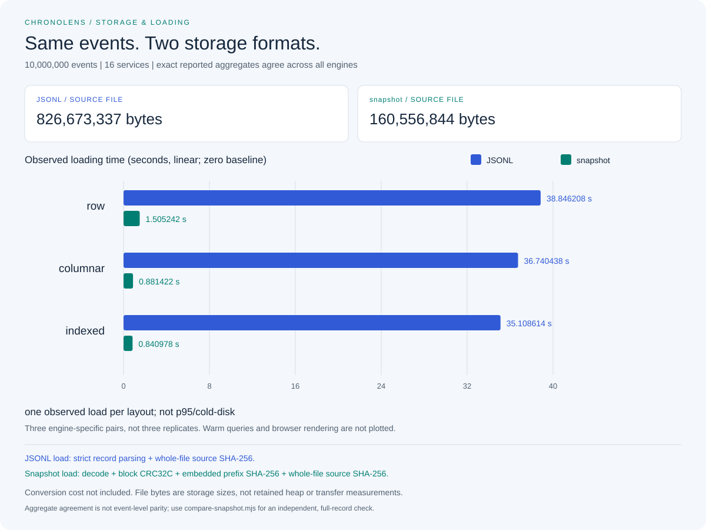

# Snapshot startup: ten million identical events

On 2026-09-15, a validated **ten-million-event indexed-layout load** took
**0.841 seconds from a snapshot**, versus **35.109 seconds from JSONL** in the
same comparison: approximately **41.7x less loading time**.

This is one observed load per engine/format on a shared development host, not
a cold-disk benchmark, startup percentile, or end-to-end browser measurement.
The conversion cost is separate and explicitly included below.



## Results

| Layout | JSONL load (s) | Snapshot load (s) | Observed time ratio |
|---|---:|---:|---:|
| Row | 38.846 | 1.505 | 25.8x |
| Columnar | 36.740 | 0.881 | 41.7x |
| Indexed | 35.109 | 0.841 | 41.7x |

The rows are three **different layouts**, not three statistical replicates.
Do not average them into a supposedly representative loading latency.

| Representation/cost | Observed value |
|---|---:|
| JSONL bytes | 826,673,337 |
| Snapshot bytes | 160,556,844 |
| File-size reduction | 80.58% |
| Snapshot blocks | 2,442 |
| One-time conversion routine | 34.402 seconds |

The smaller representation comes from block-local service dictionaries and
fixed-width columns, not a general compression library. The converter still
parses the original JSONL, builds blocks, writes checksums, syncs file data, and
publishes without overwriting another file.

Using only this observation, conversion plus one indexed snapshot load costs
about 35.243 seconds, slightly more than one JSONL indexed load. Two subsequent
loads amortize conversion. That arithmetic is illustrative, not a general
break-even guarantee: storage, caches, workload, and machine conditions matter.

### Memory did not disappear

| Layout | JSONL retained Go heap delta (MiB) | Snapshot retained Go heap delta (MiB) |
|---|---:|---:|
| Row | 308.53 | 308.50 |
| Columnar | 174.87 | 174.85 |
| Indexed | 174.86 | 174.85 |

Both readers populate the same arrays and interned service dictionary. Binary
input avoids expensive JSON decoding; it does not make the in-memory dataset
smaller or turn queries into on-disk execution. These are before/after forced-GC
`HeapAlloc` differences, **not peak memory, RSS, or a hard process limit**.
The server's multi-layout catalog has a different footprint.

## Evidence and correctness

- [JSONL report: loads, heap snapshots, predicates, aggregates, 75 warm batches](results/windows-storage-20260915-jsonl.json)
- [Snapshot report: the same measurements and cases](results/windows-storage-20260915-snapshot.json)
- [Conversion report](results/windows-storage-20260915-pack.json)
- [Independent full-record parity and checksum verification](results/windows-storage-20260915-parity.json)
- [Environment, command settings, timestamps, source-file hashes](results/windows-storage-20260915-environment.json)

The independent Node implementation compared **every field of every one of
10,000,000 events** in order. It also verified block CRC32C using a separate
implementation, trailer totals, the embedded SHA-256, end-of-file, and hashes
of both complete input files. This is stronger than matching aggregate totals:
swapping service assignments between records can preserve totals but fails the
full-record verifier.

All 30 engine/case aggregates across the two reports match the previously
published independent uniform-workload oracle. All **150 warm query batches**
met their configured duration/iteration bounds. The query engines themselves
did not gain a new algorithm in this milestone, and differences between warm
query timings are not attributed to the storage format.

| Fingerprint | SHA-256 |
|---|---|
| JSONL | `afce58436b7e769ddce7daef80c4a827d4b3f2f73bbeaf456cd203e24d290498` |
| Snapshot | `3cc834924d9a7c8aa2c072442574a96f53edb1833223707d0b94541d535bc562` |

The JSONL hash is identical to the [2026-09-14 workload](README.md). Historical
measurements remain unchanged; this report uses newly measured JSONL loads
rather than comparing today's snapshot result with yesterday's timings.

## Method and limitations

The host was a shared Windows 11 Enterprise development environment with an
Intel Xeon Platinum 8370C at 2.80 GHz, 8 reported cores / 16 logical processors,
63.95 GiB RAM, and about 20.38 GiB available at measurement start. It was not a
personal laptop or an isolated performance lab.

Both native benchmark processes used Go 1.27.1 windows/amd64, CGO disabled,
`GOMAXPROCS=16`, `GOGC=100`, and a **soft** `GOMEMLIMIT=1GiB`. The runner observes
the memory limit; it does not change machine-wide settings.

JSONL ran first, then snapshot in a fresh process. Each process loaded row,
columnar, and indexed layouts sequentially, releasing each before the next.
The independent verifier had already read both files; filesystem caches were
not flushed. No project tests or demo servers ran during these measurements,
but unrelated activity on the shared host was not controlled.

Load timers include file open/stat/read/close, source-file SHA-256, validation,
and layout construction. Snapshot validation additionally includes block CRC32C
and embedded file SHA-256. Explicit GC, metadata extraction, process startup,
conversion, queries, charts, HTTP, rendering, and reporting are excluded.
The converter's `pack_ms` measures its conversion/publication pipeline, not
whole-command startup or report serialization.

Each query case has five warm batches of at least 200 ms and three queries,
with an iteration cap and a ten-minute global deadline. Those repeated query
measurements do not convert the single load observations into percentiles.

The executable was built from the in-progress milestone based on `2135237`;
its build metadata correctly records `dirty=true`. The environment manifest
binds the relevant source via SHA-256 after CRLF-to-LF normalization. No build
metadata or history was rewritten to make the experiment appear post-commit.

## Reproduce

Begin with fewer events if memory or disk is limited. Go is sufficient for
conversion and benchmarks; Node 22.17+ runs the optional independent verifier
and chart renderer. Use new filenames: conversion and SVG publication refuse
overwrites, while shell redirection can overwrite reports.

```sh
go run ./cmd/generator -events 10000000 -services 16 -seed 42 -start 1970-01-01T00:00:00Z -interval 1us -error-percent 5 -profile uniform -output data/storage-10m-20260915.jsonl
go build -o bin/chronolens-pack ./cmd/pack
go build -o bin/chronolens-bench ./cmd/bench
```

Create `bin` if necessary. Add `.exe` to binary output names on Windows.
Use a separate shell for the following process settings or restore previous
values afterward.

```powershell
$env:GOMEMLIMIT = '1GiB'
$env:GOGC = '100'
$env:GOMAXPROCS = '16'
.\bin\chronolens-pack.exe -input data/storage-10m-20260915.jsonl -output data/storage-10m-20260915.clens -max-events 10000000
if ($LASTEXITCODE -ne 0) { throw 'Conversion failed; inspect the error before retrying.' }
.\bin\chronolens-bench.exe -input data/storage-10m-20260915.jsonl -format jsonl -max-events 10000000 -samples 5 -window 200ms -timeout 10m |
    Set-Content -Encoding utf8 data/my-jsonl-report.json
if ($LASTEXITCODE -ne 0) { throw 'JSONL run failed; discard its report.' }
.\bin\chronolens-bench.exe -input data/storage-10m-20260915.clens -format snapshot -max-events 10000000 -samples 5 -window 200ms -timeout 10m |
    Set-Content -Encoding utf8 data/my-snapshot-report.json
if ($LASTEXITCODE -ne 0) { throw 'Snapshot run failed; discard its report.' }
```

On POSIX shells, use `export GOMEMLIMIT=1GiB GOGC=100 GOMAXPROCS=16`,
`./bin/chronolens-pack` / `./bin/chronolens-bench`, and redirect successful output
to new files. Check exit codes and discard incomplete reports.

```sh
node benchmarks/compare-snapshot.mjs data/storage-10m-20260915.jsonl data/storage-10m-20260915.clens 10000000
node benchmarks/render-storage-chart.mjs data/my-jsonl-report.json data/my-snapshot-report.json data/my-storage-chart.svg
```

The verifier is bounded and deliberately rejects JSON timestamps outside
JavaScript's safe integer range; the Go codec still supports the full signed
64-bit timestamp domain. The storage chart likewise requires safe timestamp
metadata, but compares unsigned 64-bit aggregate sums without Number rounding.
Malformed or incomparable reports fail rather than producing a misleading chart.

## Remaining work stays deferred

This completes milestones 7-9, the requested **three-of-six remaining-work
boundary**, not a claim of equal engineering effort. Concurrent-load/UI latency
experiments, release packaging, and licensing/public-deployment decisions remain
the untouched second half in the [roadmap](../docs/roadmap.md).
