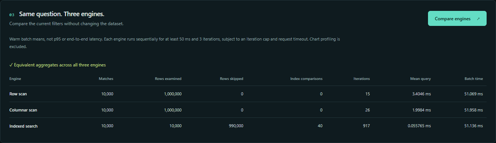

# Local API and explorer

The explorer is a React/TypeScript application backed by the existing Go query
engines. It shows actual aggregates, bounded exact charts, and measured work.
It is a **local, read-only engineering workbench**, not a publicly deployable
observability service.

## Prerequisites and setup

- Go 1.27 or later, available on PATH.
- Node.js 22.17 or later within the Node 22 release line, with npm.
- Git and enough RAM for the selected dataset's row and columnar representations.

No API keys, database, container engine, cloud account, or environment variables
are required. Standard setup:

```sh
go run ./cmd/generator -events 100000 -seed 42 -output data/explorer.jsonl
cd web
npm ci
npm run build
cd ..
go run ./cmd/server -input data/explorer.jsonl -web web/dist -listen 127.0.0.1:8080
```

Open **http://127.0.0.1:8080**. The server reports readiness only after the dataset
and frontend build are available. If the output dataset already exists, reuse it
or choose a new generator filename; the generator never overwrites it.

To explore one million events instead, generate a new file with `-events 1000000`
and point `-input` at it. Parsing large JSONL inputs happens at startup, not on
every interaction. Do not modify the file during loading.

Use Ctrl+C for graceful shutdown. A standalone server can be built with:

```sh
go build -o bin/chronolens-server ./cmd/server
```

Create `bin` first and add `.exe` to the output filename on Windows. Keep the
built `web/dist` files alongside the executable and pass their location via
`-web`. Assets are not embedded in the executable.

## Architecture


One validated source load creates a catalog. Rows receive their own layout;
the columnar and indexed engines share immutable typed arrays and the service
dictionary. Every engine therefore observes the same source snapshot.

`POST /api/query` runs an aggregate query using the chosen engine, then runs
a **separate indexed pass** to build charts. Chart work is not hidden in the
selected engine's time or candidate count. Query and chart timing and work
statistics are reported separately.

Timeline buckets contain exact matching event and 5xx counts. Histograms count
exact membership in fixed duration bins; they are not exact percentile
estimates. The service table returns at most 20 services ordered by event count,
with name as the tie-breaker, and flags truncation.

## HTTP contract

All API paths are same-origin. Errors have the shape:

```json
{"error":{"code":"invalid_filter","message":"..."}}
```

| Route | Method | Purpose |
|---|---|---|
| `/api/health` | GET | Readiness: `{"status":"ok"}` |
| `/api/meta` | GET | Dataset name, counts, timestamp bounds, service/status options, engine names and limits |
| `/api/query` | POST | Aggregate result, exact chart profile, and separate timings |
| `/api/compare` | POST | Sequential warm batches for all engines and aggregate-equivalence confirmation |

Query and comparison requests use `Content-Type: application/json` and this body:

```json
{
  "engine": "indexed",
  "from_us": "1767225620000000",
  "to_us": "1767225630000000",
  "service": "",
  "status": 0,
  "buckets": 100
}
```

`engine`, `from_us`, and `buckets` are required. `to_us` may be null or omitted
for an unbounded upper endpoint. Empty service and status 0 mean all values.
The endpoint is exclusive, exactly as in the query CLI. Comparisons use the same
filter for all three engines; the supplied valid engine does not restrict them.

For PowerShell:

```powershell
$body = @{
    engine = 'indexed'
    from_us = '1767225620000000'
    to_us = '1767225630000000'
    service = ''
    status = 0
    buckets = 100
} | ConvertTo-Json
Invoke-RestMethod -Method Post -Uri http://127.0.0.1:8080/api/query -ContentType application/json -Body $body
```

For a POSIX shell:

```sh
curl http://127.0.0.1:8080/api/query \
  -H 'Content-Type: application/json' \
  -d '{"engine":"indexed","from_us":"1767225620000000","to_us":"1767225630000000","service":"","status":0,"buckets":100}'
```

The response has `result.aggregate`, `result.stats`, `profile`, and `timing`.
Profile fields are `timeline`, `histogram`, `services`, `services_truncated`,
`rows_examined`, and `index_comparisons`.

All 64-bit timestamps and duration sums in the HTTP API are **decimal strings**.
This avoids JavaScript number rounding. A final timeline endpoint can be
`9223372036854775808` (MaxInt64+1), represented as a string. Counts are bounded
by the server event limit and fit exactly in JavaScript numbers. The CLI retains
its original numeric integer wire format.

The metadata service dropdown is limited to 256 sorted options and explicitly
flags truncation. The API still accepts any valid loaded service name.
Empty datasets expose null time bounds; empty query matches expose null
mean/min/max, not fictitious zero latency.

## Timing and comparison

| Field | Measurement |
|---|---|
| `timing.query_ms` | Selected engine's aggregate call |
| `timing.profile_ms` | Separate indexed chart-construction call |
| `timing.server_work_ms` | Combined handler work before JSON encoding |
| `results[].mean_query_ms` | Warm comparison batch mean, including loop/timing overhead |

These exclude browser rendering and network round-trip time. Unresolved
single-shot timings are null, not zero.

The comparison endpoint runs each engine sequentially for at least 50 ms and
three iterations, capped at 100,000 iterations and the shared request deadline.
If a batch cannot reach the measurement window, its mean is null and
`stable_window` is false. A completed window is not proof of low statistical
variance; the flag only says the duration threshold was met.

All three aggregate results are checked for equality before a comparison
succeeds. Charts are not included in those timed batches. Cache warmth, engine
order, other processes, and the system clock affect results. This is a useful
interactive experiment, **not p95/p99 data or a substitute for the reproducible
Go benchmarks** in [indexed-queries.md](indexed-queries.md).

### Captured example

The original screenshots use 1,000,000 generated events, seed 42, default
one-millisecond spacing, and a 1% window starting at the dataset minimum.
The browser displayed 10,000 matching events and 990,000 skipped candidate
rows for indexed execution, with equivalent aggregates across engines.



These UI batch timings include loop/timing overhead and come from one
interactive session. They are separate from the repeated Go benchmark
measurements. No API responses were mocked for these documentation images.

## Limits and safety boundaries

| Limit | Value |
|---|---|
| Default accepted events | 1,000,000 |
| Maximum configurable accepted events | 10,000,000; capacity is not a performance claim |
| Concurrent expensive requests | 2, shared by query and comparison |
| Per-query/comparison work deadline | 3 seconds |
| Request JSON body | 4 KiB |
| Timeline buckets | 1-240 |
| Result service summaries | Top 20 |
| Header read timeout | 5 seconds |
| Request read / response write timeout | 10 seconds |

Only numeric loopback bind addresses are accepted. The API validates loopback
Host headers, rejects cross-origin requests, requires JSON for POST requests,
and has no permissive CORS policy. It serves only the chosen built asset directory,
with directory listings disabled and a same-origin content security policy.

Overload returns 429 with `Retry-After: 1`; health and metadata remain available.
Invalid input returns 400, unsupported media types 415, oversized bodies 413,
and expired query deadlines 504. Disconnect cancellation stops scans at their
cooperative checkpoints. No partial aggregate/profile is returned as success.

There is no authentication, TLS termination, persistent ingestion, file upload,
or remote dataset selection. **Do not expose this server through a public proxy,
tunnel, or nonlocal deployment.** Adding a bind flag does not make it a
production internet service.
Other local processes can access the API; loopback is not an authentication
boundary between users. Do not load confidential datasets on shared or untrusted
machines.

## Development and tests

```sh
go test -count=1 ./...
go vet ./...
cd web
npm ci
npm run build
npm run test:e2e
```

If Playwright reports a missing Chromium executable, install the matching
browser with `npx playwright install chromium`. Linux runners may also need
`npx playwright install --with-deps chromium`. Browser tests build and start
a real Go server against a temporary generated dataset, rather than relying
only on mocked responses.

Linux CI also runs:

```sh
go test -race -count=1 ./internal/query ./internal/api ./cmd/server
```

For frontend iteration, run the Go server with an existing frontend build, then
run `npm run dev` in `web` and use Vite's displayed URL. Its `/api` proxy targets
127.0.0.1:8080 and preserves the browser Host for same-origin validation.

## Troubleshooting

- **Missing frontend build:** run `npm ci` and `npm run build` inside `web`.
- **Address already in use:** stop your own server or choose another loopback port.
- **403:** use the loopback URL printed by the server, not a custom hostname,
  file URL, external origin, or public proxy.
- **429:** let the current comparison finish and retry; rapid interactions may
  cancel superseded work.
- **Null timing:** the operation was below observable clock resolution; use a
  comparison batch or the Go benchmarks.
- **Large startup memory or time:** reduce the dataset. The comparison catalog
  retains both a row and a columnar layout; the ten-million-event configuration
  ceiling is not a demonstrated capacity guarantee.
