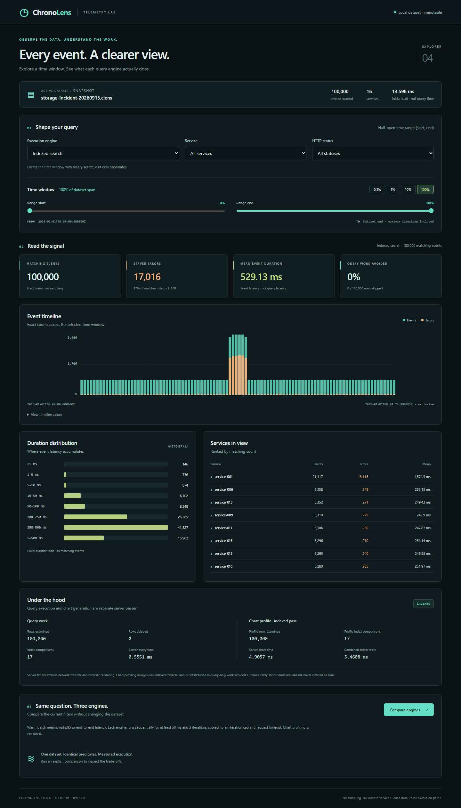

# Immutable snapshots

Snapshots address the JSONL startup bottleneck by storing validated events as
packed binary columns. They are immutable exports, not a live database, a WAL,
a result cache, or memory-mapped execution.

## Convert a dataset

```sh
go run ./cmd/generator -events 100000 -profile incident -output data/incident.jsonl
go run ./cmd/pack -input data/incident.jsonl -output data/incident.clens
```

`pack` accepts regular JSONL files, validates every record, preserves timestamp
order and ties, and writes a versioned snapshot. It emits a JSON report with
event/block counts, actual source SHA-256, source/snapshot byte counts, and total
conversion time. Errors go to stderr and return a nonzero exit code.

| Flag | Default | Meaning |
|---|---|---|
| `-input` | `data/events.jsonl` | Regular ordered JSONL input; not stdin |
| `-output` | `data/events.clens` | New destination path; never overwrites |
| `-max-events` | `1000000` | 1-100,000,000 accepted records; not a memory cap |

Empty input produces a valid empty snapshot. Conversion uses bounded blocks
rather than retaining the full dataset. Service dictionaries and checksum work
are part of conversion, not hidden background costs. Source metadata is checked
before and after reading; keep the input unchanged throughout conversion.

## Publication and failure behavior

The converter writes a private, same-directory `.chronolens-pack-*.tmp` file,
flushes and syncs its data, closes it, and publishes it with a hard link to the
requested destination. Creating that name is atomic and does not replace an
existing path, even if another process creates the destination during conversion.
The temporary name is removed afterward.

This requires filesystem support for hard links, such as local NTFS or ext4.
Unsupported filesystems fail explicitly; there is no unsafe overwrite/rename
fallback. New files retain the private permissions of the temporary file.
Generated `.clens` files and private staging files are ignored by Git.

Handled failures before publication remove the private file. A force kill can
leave a staging file; never treat it as a published snapshot. After publication,
a cleanup or report-output failure may return an error while leaving the valid
destination intact. Inspect the error before retrying, and choose a new filename.
Cancellation is cooperative; it cannot undo an already published file.

File data is synced, but directory metadata is not explicitly synced across all
platforms. **Atomic visibility is not a universal power-loss durability guarantee.**
Do not describe this as a transactional storage engine.

## Integrity and resource limits

The format uses a fixed versioned header, bounded block-local service
dictionaries, packed integer columns, block checksums, and a mandatory
whole-file integrity trailer. The reader rejects unsupported versions/flags,
bad lengths, malformed dictionaries, invalid service IDs/statuses/timestamps,
count mismatches, corrupt checksums, truncation, and trailing bytes.

Checksums detect accidental corruption; they do not authenticate a sender.
Semantic validation remains necessary even when checksums match. Readers cap
block sizes before allocating memory and enforce the caller's event limit.
The existing schema bounds still apply, including nonnegative timestamps,
UTF-8 service names, HTTP statuses 100-599, and at most 65,536 distinct services.

Library readers can visit earlier blocks before a later error is discovered.
Consumers must discard all partial results on any read error, including a bad
trailer. Library writers likewise require callers to discard partial output.
Neither library API closes caller-owned streams.

## Version 1 wire contract

All integers are little-endian. Version 1 uses no platform-dependent alignment.

| Component | Exact layout |
|---|---|
| Header, 16 bytes | `CHRONOSN` (8 bytes), uint16 version 1, uint16 flags 0, uint32 reserved 0 |
| Block framing, 16 bytes | `BLK1`, uint32 rows, uint32 dictionary entries, uint32 payload bytes |
| Dictionary prefix | Each entry: uint16 UTF-8 byte length, then name bytes; IDs follow first-occurrence order |
| Columns | N int64 timestamps, N uint16 dictionary IDs, N uint32 durations, N uint16 statuses |
| Block checksum, 4 bytes | CRC32C/Castagnoli over the block framing and payload |
| Trailer, 52 bytes | `END1`, uint64 total events, uint64 total blocks, 32-byte SHA-256 |

SHA-256 covers every preceding file byte, including the trailer marker and
totals but not the digest itself. End-of-file is mandatory immediately afterward.
Blocks contain 1-4,096 rows and 1-N unique dictionary entries. The maximum
payload is 598,016 bytes; tighter row/dictionary-derived limits are checked too.
Empty files encode as a 68-byte header-plus-trailer snapshot.

For the default 100,000-event incident fixture, conversion produced **25 blocks**
and **1,605,768 bytes**, versus **9,197,274 JSONL bytes**. An independent Node
decoder compared all four fields of all 100,000 events and verified the trailer.
This is a representation-size observation, not a startup-speed measurement.

The Go tests cover deterministic encoding, boundary values, multiple blocks,
all prefixes/truncation, forged lengths, invalid semantic data with repaired
checksums, corruption, limits, I/O failures, cancellation, and callback failure.
A bounded reader fuzz target is included.

## Query and explore

```sh
go run ./cmd/query -input data/incident.clens -format snapshot -engine indexed
go run ./cmd/server -input data/incident.clens -format snapshot -web web/dist -listen 127.0.0.1:8080
```

Both commands accept `-format jsonl|snapshot`, with **JSONL as the default**.
Selection is explicit, not inferred from the extension. A bad snapshot header,
checksum, or trailer fails loading; it never triggers a JSONL fallback.
The query report and `/api/meta` include `input_format`. The explorer labels
the loaded format without changing query controls or chart semantics.

```text
JSONL ----------------> strict JSONL reader ---+
  |                                           |
  +-- pack --> snapshot --> CRC/SHA reader ----+--> shared layout builder
                                                        |
                                      row / columnar / indexed queries
                                                        |
                                            loopback API --> explorer
```

The entire source must validate before a dataset becomes queryable or the
server listens. A snapshot is decoded into the same immutable in-memory layouts
as JSONL. The server still retains rows and shared columnar/indexed arrays;
snapshots do not introduce lazy disk access or reduce the logical event count.



Shown: 100,000 actual incident-profile events loaded from the converter's
snapshot, with 17,016 server errors and the same traffic spike as the JSONL
source. The displayed startup time is one observation, not a repeated benchmark.

`query.Load` and `query.LoadCatalog` remain JSONL-compatible library entry
points. Their explicit-format counterparts share the same event accumulation
logic, limits, and interning. Cross-format tests compare complete aggregates,
exact profiles, and metadata, including ties, boundary values, and empty data.

`npm run test:e2e` in `web` builds once and runs the existing suite sequentially
against JSONL and freshly packed snapshot fixtures. Each run starts and owns its
own server/workspace. To inspect just the snapshot suite interactively, use
`npx playwright test --config playwright.snapshot.config.ts --ui`.

The benchmark CLI also accepts `-format snapshot`, retaining JSONL by default.
It records the selected format and hashes the complete source separately for
each engine load. A format comparison requires separate runs over matching
inputs; source-byte hashes differ by representation, while logical events and
query results must agree.

```sh
go run ./cmd/bench -input data/incident.clens -format snapshot -max-events 100000
```

The [development history](roadmap.md) records snapshot integration, measured
startup improvements, and the completed local explorer scope.

The [ten-million-event startup comparison](../benchmarks/snapshot-startup.md)
publishes actual conversion cost, file sizes, validated loading times, source
provenance, and independent full-record verification.
