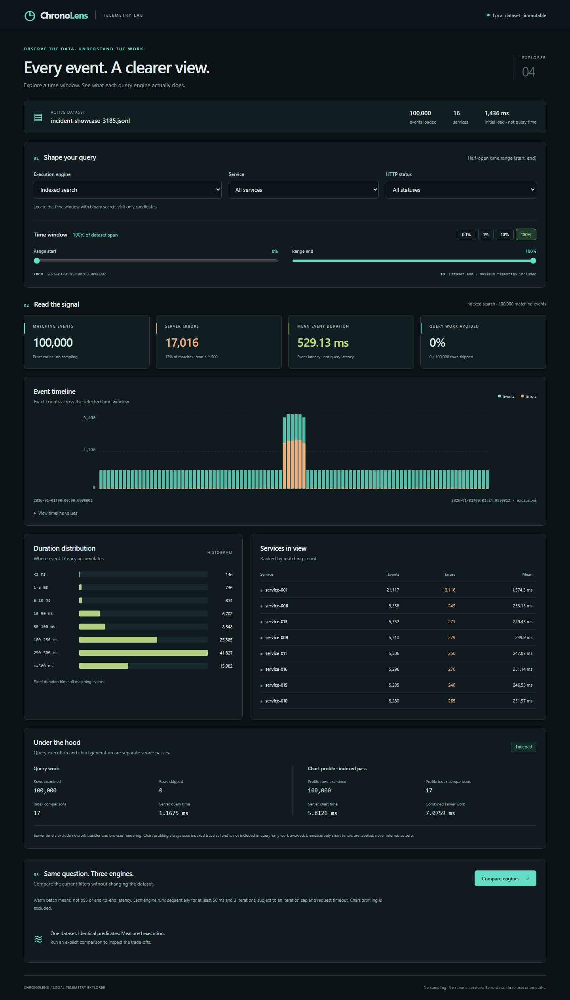

# Reproducible workload profiles

Both profiles stream the same four-field JSONL schema and remain strictly
timestamp-ordered. A profile is selected at generation time, not fabricated by
the frontend. The existing reader, scan/indexed engines, and chart profiler
operate on the actual generated events without special incident logic.

## Uniform baseline

`-profile uniform` is the default. Services are uniform, durations are uniform
integers in [100, 500000] microseconds, and each event independently uses the
configured baseline error probability. Timestamp gaps equal `-interval`.

The old default output is preserved byte-for-byte. A compatibility test fixes
the SHA-256 of a pre-change 1,000-event fixture with seed 42, four services,
the default start, one-millisecond intervals, and a 5% failure probability:

```text
b43192acd01023c86ab8ecafcdcfc004b5df8f1c5df08d79cf558b9fb3c969dc
```

## Incident profile

```sh
go run ./cmd/generator -profile incident -events 100000 -services 16 -seed 42 -output data/incident.jsonl
go run ./cmd/server -input data/incident.jsonl -web web/dist -listen 127.0.0.1:8080
```

The profile requires at least five events and a base interval divisible by four
microseconds. Invalid configurations fail before an output file is created.

| Phase | Event ordinals, zero-based | Behavior |
|---|---|---|
| Baseline | Before `floor(2N/5)` | Original uniform service, duration, and failure draws |
| Incident | `[floor(2N/5), floor(3N/5))` | Timestamp gaps are one quarter of the base interval |
| Recovery | Remaining events | Original uniform draws and base interval resume |

Within the incident, each event has an independent 80% chance of becoming a
congested request. Congested requests target `service-001`, use uniform integer
durations from 1,000,000 through 3,000,000 microseconds, and fail with probability
`max(80, error-percent)` percent. Other requests retain their baseline values.

Ordinary requests can also choose `service-001`, so its total incident traffic
share is slightly greater than 80% when multiple services are configured.
Finite samples do not have guaranteed exact probability counts.

A separate seeded random stream drives congestion. The original baseline
stream still advances once per event, so baseline and recovery service/duration/
status values match the same event ordinals in a uniform dataset. Recovery
timestamps remain shifted by the compressed incident duration.

The interval after an incident event is also compressed, including the gap to
the first recovery event. This keeps the incident's time window half-open and
its event count precise.

## Expected timing and chart behavior

For **100,000 events, the default start, and a one-millisecond base interval**:

| Quantity | Value |
|---|---|
| Baseline events | 40,000 |
| Incident events | 20,000 |
| Recovery events | 40,000 |
| Incident timestamp range | 2026-01-01T00:00:40Z through 00:00:45Z, exclusive |
| Last event timestamp | 2026-01-01T00:01:24.999Z |
| Relative event density in incident | Four times the baseline |

The compressed incident occupies roughly 47%-53% of the final **time span**,
not 40%-60%. The latter percentages describe event ordinals. Explorer slider
percentages are time percentages; conflating the two would produce misleading
experiments.

```sh
go run ./cmd/query -input data/incident.jsonl -engine indexed -from-us 1767225640000000 -to-us 1767225645000000
go run ./cmd/query -input data/incident.jsonl -engine row -from-us 1767225640000000 -to-us 1767225645000000
```

Both engines must report exactly 20,000 matching events. Add
`-service service-001 -status 500` to isolate the failure concentration.
The indexed engine reduces candidate visits only through the time predicate;
service-only filtering still requires a full candidate scan.



The image uses the real 100,000-event profile with seed 42. No browser response
or chart series is mocked. Chart bucket alignment can straddle phase boundaries;
the exact four-times density is easiest to see in aligned buckets.

## Verification and limitations

Tests cover uniform compatibility, incident reproducibility, different seeds,
gap compression, recovery, probability boundaries, invalid configuration,
overflow-safe phase arithmetic, and exact chart/query agreement. An integration
fixture with 10,000 events uses aligned half-second buckets: ordinary buckets
contain 500 events and the incident bucket contains exactly 2,000.

This is not a queueing or retry simulator. It does not infer causes, model
dependencies, implement live ingestion, or establish real-world traffic
distributions. Its purpose is to expose correlations and workload-dependent
tradeoffs in a reproducible engineering experiment.
